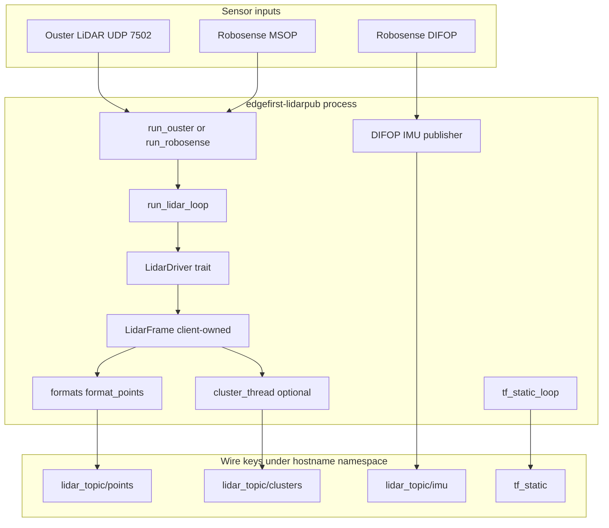
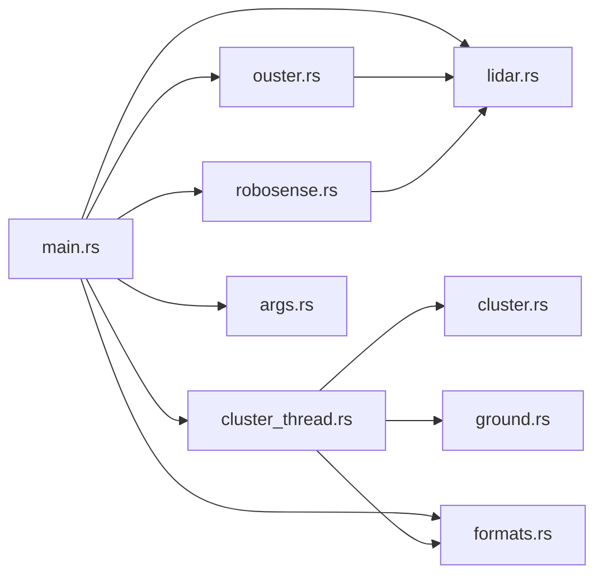
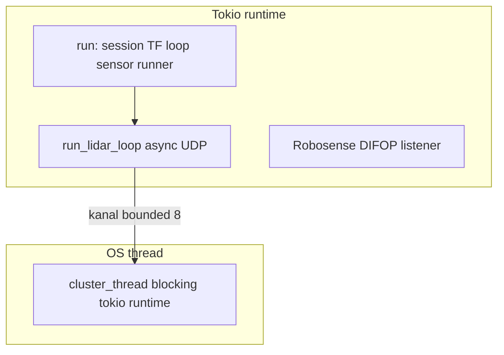
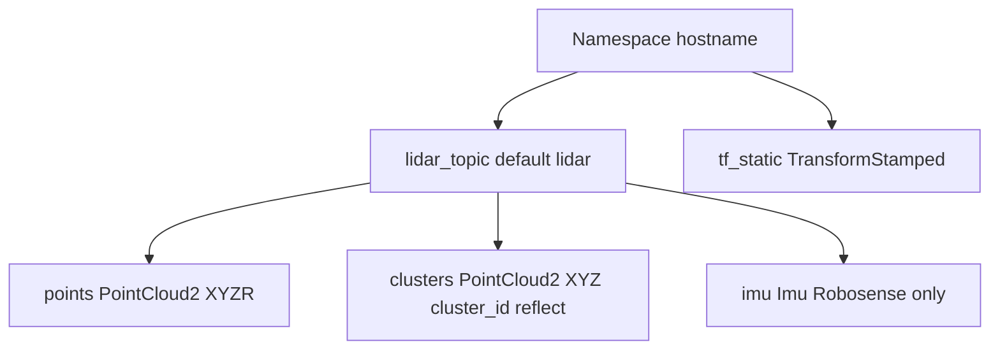

# EdgeFirst LiDAR Publisher - Architecture Documentation

**Version:** 2.3  
**Last Updated:** 2026-09-15  
**Project:** EdgeFirst LiDAR Publisher  
**License:** Apache-2.0

---

## Table of Contents

1. [Overview](#overview)
2. [System Architecture](#system-architecture)
3. [Module Structure](#module-structure)
4. [Data Flow](#data-flow)
5. [Threading Model](#threading-model)
6. [Message Publishing](#message-publishing)
7. [SIMD Optimization](#simd-optimization)
8. [Ground Plane Filter](#ground-plane-filter)
9. [Clustering Algorithms](#clustering-algorithms)
10. [Pipeline Instrumentation](#pipeline-instrumentation)
11. [Error Handling](#error-handling)
12. [Configuration](#configuration)
13. [Deployment](#deployment)
14. [Testing](#testing)
15. [Tracy Profiling](#tracy-profiling)
16. [Code Locations Reference](#code-locations-reference)

---

## Overview

The EdgeFirst LiDAR Publisher (`edgefirst-lidarpub`) receives UDP packets from Ouster or Robosense LiDAR sensors, assembles frames in client-owned buffers, optionally applies ground plane removal and spatial clustering, and publishes ROS2-compatible CDR messages over Zenoh.

### Technology Stack

- **Language:** Rust 2024 edition (stable toolchain)
- **Async Runtime:** Tokio (multi-threaded)
- **Messaging:** Zenoh 1.x (session namespace = system hostname)
- **Serialization:** CDR via **edgefirst-schemas** (PointCloud2, Imu, TransformStamped)
- **SIMD:** NEON intrinsics on aarch64 for point formatting and clustering distance checks
- **Profiling:** Tracy integration via `tracing-tracy`
- **Dependencies:** See `Cargo.toml`

### Target Platforms

**Primary:** Maivin, Raivin (NXP i.MX 8M Plus)  
**Development:** x86_64 Linux, ARM64 Linux

---

## System Architecture

### Component Overview


```mermaid
graph TB
    subgraph Sensors [Sensor inputs]
        OusterUDP["Ouster LiDAR UDP 7502"]
        RsMSOP["Robosense MSOP"]
        RsDIFOP["Robosense DIFOP"]
    end

    subgraph App [edgefirst-lidarpub process]
        Entry["run_ouster or run_robosense"]
        Loop["run_lidar_loop"]
        Driver["LidarDriver trait"]
        Frame["LidarFrame client-owned"]
        Format["formats format_points"]
        ClusterT["cluster_thread optional"]
        TF["tf_static_loop"]
        IMUPub["DIFOP IMU publisher"]
    end

    subgraph Zenoh [Wire keys under hostname namespace]
        Points["lidar_topic/points"]
        Clusters["lidar_topic/clusters"]
        IMU["lidar_topic/imu"]
        TFKey["tf_static"]
    end

    OusterUDP --> Entry
    RsMSOP --> Entry
    Entry --> Loop
    Loop --> Driver --> Frame
    Frame --> Format --> Points
    Frame --> ClusterT --> Clusters
    RsDIFOP --> IMUPub --> IMU
    TF --> TFKey
```

### Key Components

| Component | Location | Responsibility |
|-----------|----------|----------------|
| CLI / Zenoh config | `src/args.rs` | Parses args, sets hostname namespace, builds Zenoh `Config` |
| Ouster driver | `src/ouster.rs` | Packet parse, internal depth/reflect grids, fused XYZ into frame |
| Robosense driver | `src/robosense.rs` | MSOP/DIFOP parse, E1R point cloud + device info |
| Lidar traits | `src/lidar.rs` | `LidarDriver`, `LidarFrame`, shared `Points`, errors |
| Main loop | `src/main.rs::run_lidar_loop` | UDP recv, `driver.process`, publish points, enqueue clustering |
| CDR formatting | `src/formats.rs`, `main.rs::format_points` | PointCloud2 builders, clustered layout |
| Ground filter | `src/ground.rs` | IMU-guided PCA floor removal (cluster path) |
| Clustering | `src/cluster.rs` | DBSCAN and voxel algorithms |
| Cluster pipeline | `src/cluster_thread.rs` | Ground filter, cluster, relabel, publish clusters |
| TF broadcast | `src/main.rs::tf_static_loop` | 1 Hz TransformStamped |
| Packet sources (tests) | `src/packet_source.rs` | UDP/test `PacketSource` trait |
| PCAP replay (library) | `src/pcap_source.rs` | `PcapSource` when `pcap` feature is enabled (examples/tests, not `main` dispatch) |

---

## Module Structure

### File Organization

```
src/
├── main.rs              - Entry, sensor runners, run_lidar_loop, TF, IMU publish
├── ouster.rs            - Ouster OS1 protocol, FrameReader, OusterLidarFrame
├── robosense.rs         - Robosense E1R MSOP/DIFOP
├── cluster.rs           - DBSCAN and voxel clustering (NEON SIMD)
├── cluster_thread.rs    - Clustering pipeline with instrumentation
├── ground.rs            - IMU-guided PCA ground plane filter
├── formats.rs           - PointCloud2 CDR serialization (SIMD)
├── args.rs              - CLI configuration, zenoh_namespace()
├── common.rs            - Shared utilities, timestamps
├── lidar.rs             - Sensor traits and types
├── packet_source.rs     - PacketSource trait (UDP, test fixtures)
├── pcap_source.rs       - PCAP replay (`pcap` feature)
└── lib.rs               - Library exports and crate-level docs

examples/
├── pcap_viewer.rs       - Offline PCAP replay with Rerun (`rerun` + `pcap`)
└── lidar_viewer.rs      - Live visualization

benches/
├── cluster_bench.rs
├── driver_bench.rs
└── format_points_bench.rs

testdata/
└── e1r_frame0.pcd       - Real E1R point cloud for tests
```

### Module Dependencies


```mermaid
graph LR
    main["main.rs"]
    ouster["ouster.rs"]
    robosense["robosense.rs"]
    cluster_thread["cluster_thread.rs"]
    cluster["cluster.rs"]
    ground["ground.rs"]
    formats["formats.rs"]
    args["args.rs"]
    lidar["lidar.rs"]

    main --> args
    main --> ouster
    main --> robosense
    main --> cluster_thread
    main --> formats
    main --> lidar
    cluster_thread --> cluster
    cluster_thread --> ground
    cluster_thread --> formats
    ouster --> lidar
    robosense --> lidar
```

### Client-Owned Frame Pattern

Drivers never allocate publish buffers per frame. The client creates a frame (`OusterLidarFrame::with_capacity`, Robosense equivalent), passes `&mut frame` to `LidarDriver::process`, and on `Ok(true)` formats and publishes from that frame. See `src/lib.rs` module documentation.

**Ouster internal buffers:** `FrameReader` keeps `Array2<u16>` depth and `Array2<u8>` reflect grids while assembling packets. These are **not** published on Zenoh; fused Cartesian coordinates and reflectivity are written into the frame and exported only as PointCloud2.

---

## Data Flow

### End-to-end pipeline

```mermaid
sequenceDiagram
    participant UDP as UDP socket
    participant Loop as run_lidar_loop
    participant Drv as LidarDriver
    participant Fr as LidarFrame
    participant Fmt as format_points
    participant Z as Zenoh publishers
    participant Cl as cluster_thread

    loop Each UDP datagram
        UDP->>Loop: packet bytes
        Loop->>Drv: process frame packet
        alt frame incomplete
            Drv-->>Loop: Ok false
        else frame complete
            Drv-->>Loop: Ok true
            Loop->>Cl: send ranges points timestamp imu optional
            Loop->>Fmt: PointCloud2 CDR
            Fmt->>Z: lidar_topic/points
            Cl->>Z: lidar_topic/clusters when enabled
        end
    end
```

### Robosense IMU side path

DIFOP packets on `--difop-port` are handled on a separate async task. Parsed accelerometer/gyroscope samples are published to `{lidar_topic}/imu` and the latest accelerometer reading is shared (mutex) with the clustering thread when `--ground-filter` is enabled.

---

## Threading Model


```mermaid
graph TB
    subgraph Tokio [Tokio runtime]
        MainTask["run: session TF loop sensor runner"]
        LidarLoop["run_lidar_loop async UDP"]
        DifopTask["Robosense DIFOP listener"]
    end

    subgraph OS [OS thread]
        ClusterThread["cluster_thread blocking tokio runtime"]
    end

    MainTask --> LidarLoop
    LidarLoop -->|"kanal bounded 8"| ClusterThread
```

**Clustering channel** (`run_lidar_loop`): capacity 8, payload `(Vec<f32> ranges, Points, Time, Option<IMU accel>)`. The cluster thread drains the latest frame when backlogged.

---

## Message Publishing

### Zenoh namespace and keys

`Args` converts to Zenoh `Config` with `namespace` = system hostname (`gethostname`, fallback `localhost` if empty or contains `/`). Application keys are **not** prefixed with `rt/` (removed in 2.3.0).

| Application key | Example wire key (default topic) | Message schema | When |
|-----------------|----------------------------------|----------------|------|
| `{lidar_topic}/points` | `{hostname}/lidar/points` | `sensor_msgs/msg/PointCloud2` | Every frame |
| `{lidar_topic}/clusters` | `{hostname}/lidar/clusters` | `sensor_msgs/msg/PointCloud2` | `--clustering` set |
| `{lidar_topic}/imu` | `{hostname}/lidar/imu` | `sensor_msgs/msg/Imu` | Robosense DIFOP |
| `tf_static` | `{hostname}/tf_static` | `geometry_msgs/msg/TransformStamped` | 1 Hz |

Publisher declarations live in `run_lidar_loop`, the Robosense DIFOP handler, and `tf_static_loop`. Point clouds, IMU, and `tf_static` use `publish_cdr()` in `main.rs` to attach a Zenoh source timestamp. Cluster output is published from `cluster_thread` via `.put(...).timestamp(session.new_timestamp())` (same timestamp semantics, separate call site).

### QoS

| Key suffix | Priority | Congestion control |
|------------|----------|-------------------|
| `/points`, `/clusters` | DataHigh | Drop |
| `/imu` | Data | Drop |
| `tf_static` | Background | Drop |

### Topic structure


```mermaid
graph TD
    NS["Namespace hostname"]
    NS --> Base["lidar_topic default lidar"]
    Base --> P["points PointCloud2 XYZR"]
    Base --> C["clusters PointCloud2 XYZ cluster_id reflect"]
    Base --> I["imu Imu Robosense only"]
    NS --> TF["tf_static TransformStamped"]
```

### CDR serialization

**Raw PointCloud2** (`format_points` / `formats.rs`):
- Fields: x, y, z (FLOAT32), reflect (UINT8)
- Point step: 13 bytes
- Optional axis mirroring via `--mirror`

**Clustered PointCloud2** (`format_points_clustered`):
- Fields: x, y, z, cluster_id (UINT32), reflect (UINT8)
- Point step: 17 bytes

**Imu** (Robosense DIFOP path in `main.rs`):
- Built with `Imu::builder()` from edgefirst-schemas

**TransformStamped** (`tf_static_loop`):
- Static transform from `--base-frame-id` to `--frame-id`
- Translation `--tf-vec`, rotation `--tf-quat`
- Published every 1 s

---

## SIMD Optimization

### Ouster Cartesian generation

`FrameBuilder::update_fused` reads internal depth/reflect slices, converts range to meters, copies reflectivity into the client frame, and calls `calculate_points_fused_into()` to write x/y/z into the `LidarFrameWriter` buffers. Implementations use NEON on aarch64, optional `portable_simd` on other targets, and scalar fallbacks.

### PointCloud2 formatting

`formats.rs` provides SIMD paths for packing interleaved XYZR (13 bytes/point) and clustered XYZ + `cluster_id` + `reflect` (17 bytes/point) into CDR-backed buffers. See `benches/format_points_bench.rs` for performance characterization.

---

## Ground Plane Filter

**Implementation:** `src/ground.rs` — `GroundFilter` struct

The ground plane filter uses IMU data to determine the gravity direction, then applies
region-wise PCA (inspired by the Patchwork algorithm) to detect and remove floor points
before clustering. This prevents nearby objects from being connected through shared
floor points.

### Algorithm

1. **Gravity vector** — The IMU accelerometer reading (remapped to LiDAR frame
   coordinates) is normalized to a unit gravity vector. All subsequent height
   calculations project points onto this axis via dot product.

2. **Polar grid binning** — Valid points are binned into a polar grid of 16 azimuth
   sectors × 8 range rings (out to 30m). Points closer than 0.5m are excluded from
   detection to avoid sensor housing artifacts.

3. **Per-patch PCA** — For each occupied patch, the lowest-K points along the gravity
   axis (K=20) are selected as seeds. A 3×3 covariance matrix is computed from the
   seeds and its eigenvalues are found using Cardano's closed-form formula for cubic
   roots (no iterative solver needed). The patch is accepted as ground if:
   - **Uprightness** > 0.85 — the smallest eigenvector aligns with gravity
   - **Flatness** < 0.03 — the smallest eigenvalue ratio indicates a plane
   - **Elevation** within ±1.0m of the current ground height estimate

4. **Ground height** — The median seed height across all accepted patches establishes
   the ground level. An EMA (alpha=0.5) smooths this across frames with a 0.5m jump
   gate for fast convergence on large changes.

5. **Classification** — Every point whose height along the gravity axis is at or below
   `ground_height - thickness_m` is marked as ground. This is one-sided: anything below
   the ground surface is always removed. No range gate is applied during classification
   so near-field floor points are also caught.

### Sensor Height Override

When `--sensor-height` is set, steps 2–4 are skipped and the provided height is used
directly. This is useful when the sensor is in a fixed mount and auto-detection is
unreliable (e.g. looking straight down with few ground patches visible).

### IMU Axis Remap (Robosense E1R)

The E1R's built-in IMU axes differ from its LiDAR point cloud frame. The remap
applied in `src/main.rs` is:

```
LiDAR = (imu_z, -imu_x, -imu_y)
```

### Cluster ID Scheme

When the ground filter is active, cluster IDs follow a reserved scheme:

| ID | Meaning |
|----|---------|
| 0  | Noise (invalid returns, too-few-neighbors) |
| 1  | Ground plane |
| 2+ | Real clusters |

Constants `CLUSTER_ID_NOISE`, `CLUSTER_ID_GROUND`, and `CLUSTER_ID_FIRST` are defined
in `src/cluster.rs`.

---

## Clustering Algorithms

Two clustering algorithms are available, selected via `--clustering`:

### DBSCAN (`--clustering=dbscan`)

**Implementation:** `cluster_()` and `expand_cluster()` in `src/cluster.rs`

A full 3D DBSCAN using a spatial hash for O(n) average neighbor queries. Points are
binned into voxels of size `eps`, and neighbor searches check the 27 adjacent voxels
(3×3×3 cube). On aarch64, distance checks use NEON SIMD intrinsics to process 4
points per iteration.

**Parameters:**
- `eps` (CLUSTERING_EPS): 3D Euclidean distance threshold in mm (default: 200)
- `min_pts` (CLUSTERING_MINPTS): Minimum neighbors to be a core point (default: 4)
- `bridge_pts` (CLUSTERING_BRIDGE): Minimum neighbors for a point to **propagate**
  during BFS expansion.

**Performance:** ~70ms per frame on E1R 25k points (aarch64 Cortex-A).

### Voxel Connected-Component (`--clustering=voxel`)

**Implementation:** `voxel_cluster()` in `src/cluster.rs`

Faster BFS over occupied voxels. **Performance:** ~13ms per frame on E1R 25k points (aarch64) with bridge=10.

### Output Format

**Clustered PointCloud2** (published to `{lidar_topic}/clusters`):
- Fields: x, y, z, cluster_id, reflect
- Point step: 17 bytes

---

## Pipeline Instrumentation

**Implementation:** `src/cluster_thread.rs`

Stages `valid_mask`, `ground_filter`, `clustering`, `relabel`, and `publish` use
`tracing::info_span!()` (visible in Tracy when `--tracy` is set). The CDR format step is
timed with `Instant` only (no span). Per-stage `Instant` accumulators log averages every
100 frames.

| Stage | Tracing |
|-------|---------|
| Valid mask | span `valid_mask` |
| Ground filter | span `ground_filter` |
| Clustering | span `clustering` |
| Relabel | span `relabel` |
| Format clustered PC2 | `Instant` only (`format_points_clustered`) |
| Publish | span `publish` |

Example:

```
pipeline avg over 100 frames (24967 pts): valid=0.2ms ground=9.3ms cluster=13.2ms relabel=0.5ms format=3.4ms publish=2.6ms total=29.1ms
```

Frame marks in `run_lidar_loop` when `--tracy` is enabled.

---

## Error Handling

- **Packet-level errors:** Logged at debug/warn; processing continues (UDP loss tolerant).
- **Publish errors:** Logged; loop continues.
- **Cluster thread:** CDR encode failures log an error and skip the frame; Zenoh publish
  failures log and continue. Failure to spawn the clustering OS thread exits the process.
- **Configuration / sensor setup (Ouster):** Fatal at startup when HTTP config fails.

Drivers return the unified `lidar::Error` enum.

---

## Configuration

See [`lidarpub.default`](lidarpub.default) for the full environment-variable template shipped with releases.

**Notable CLI / env:**

| Variable | Default | Notes |
|----------|---------|-------|
| `SENSOR_TYPE` | `ouster` (CLI) | `robosense` in packaged default file |
| `LIDAR_TOPIC` | `lidar` | Prefix for points/clusters/imu keys |
| `MODE` | `peer` | Zenoh participant mode (not sensor scan rate) |
| `CLUSTERING` | `""` | `dbscan`, `voxel`, or empty |

Zenoh: `--mode`, `--connect`, `--listen`, `--no-multicast-scouting` (see `args.rs`).

**Build profiles:** `release`, `debug`, `profiling` (see `Cargo.toml`).

---

## Deployment

### Binary

Production binary name: **`edgefirst-lidarpub`** (`target/release/edgefirst-lidarpub`).

### Cross-compilation

```bash
cargo install cargo-zigbuild
cargo zigbuild --target aarch64-unknown-linux-gnu.2.35 --release
# artifact: target/aarch64-unknown-linux-gnu/release/edgefirst-lidarpub
```

### Systemd

Configure via `/etc/default/lidarpub` and invoke:

```ini
ExecStart=/usr/local/bin/edgefirst-lidarpub
EnvironmentFile=-/etc/default/lidarpub
```

### Network

- **Ouster:** This publisher binds LiDAR UDP **7502** only (no Ouster IMU port 7503 path); HTTP configuration API
- **Robosense E1R:** MSOP 6699, DIFOP 7788
- **Zenoh:** peer multicast or client to router (TCP 7447 typical)

### Example subscribers

```bash
HOST=$(hostname)
z_sub -k "${HOST}/lidar/points"
z_sub -k "${HOST}/lidar/clusters"
z_sub -k "${HOST}/lidar/imu"
z_sub -k "${HOST}/tf_static"
```

---

## Testing

See [TESTING.md](TESTING.md) for CI, coverage gates, hardware scenarios, and on-target deployment. Unit and integration tests live under `src/**` modules and `tests/`.

---

## Tracy Profiling

```bash
cargo build --release --features tracy
./target/release/edgefirst-lidarpub --sensor-type robosense --tracy
```

Connect with the Tracy GUI. Cluster pipeline spans and frame marks map to LiDAR frame boundaries in `run_lidar_loop`.

---

## Code Locations Reference

| File | Key symbols |
|------|-------------|
| `main.rs` | `run`, `run_ouster`, `run_robosense`, `run_lidar_loop`, `format_points`, `publish_cdr`, `tf_static_loop` |
| `ouster.rs` | `FrameReader`, `OusterLidarFrame`, `calculate_points_fused_into` |
| `robosense.rs` | `RobosenseDriver`, MSOP/DIFOP parsers |
| `formats.rs` | PointCloud2 CDR builders, clustered layout |
| `cluster_thread.rs` | `cluster_thread` async pipeline |
| `cluster.rs` | `cluster_`, `voxel_cluster`, DBSCAN helpers |
| `ground.rs` | `GroundFilter` |
| `args.rs` | `Args`, `zenoh_namespace`, Zenoh `Config` conversion |
