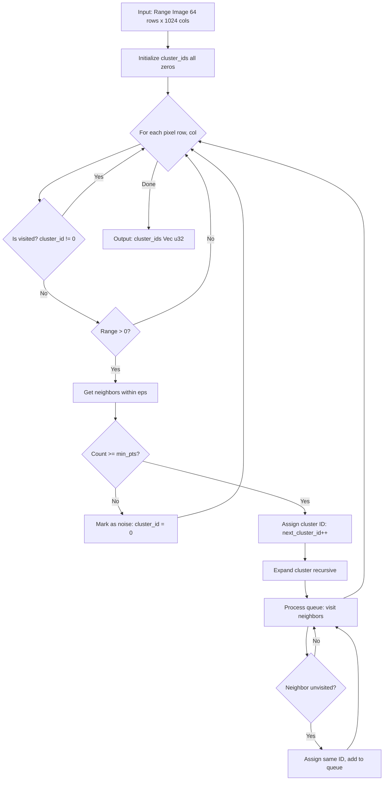

# EdgeFirst LiDAR Publisher - Architecture Documentation

**Version:** 2.0  
**Last Updated:** 2025-11-25  
**Project:** EdgeFirst LiDAR Publisher  
**License:** Apache-2.0

---

## Table of Contents

1. [Overview](#overview)
2. [System Architecture](#system-architecture)
3. [Module Structure](#module-structure)
4. [Data Flow](#data-flow)
5. [Threading Model](#threading-model)
6. [Message Publishing](#message-publishing)
7. [SIMD Optimization](#simd-optimization)
8. [Clustering Algorithm](#clustering-algorithm)
9. [Error Handling](#error-handling)
10. [Configuration](#configuration)

---

## Overview

The EdgeFirst LiDAR Publisher is a Rust application that receives UDP packets from an Ouster OS1-64 LiDAR sensor, transforms the data into 3D point clouds, and publishes ROS2-compatible messages via Zenoh.

### Technology Stack

- **Language:** Rust 2024 edition
- **Async Runtime:** Tokio (multi-threaded)
- **Messaging:** Zenoh 1.6.2
- **Serialization:** CDR (ROS2 Common Data Representation)
- **SIMD:** portable_simd (nightly feature)
- **Dependencies:** See `Cargo.toml` for complete list

### Target Platforms

**Primary:**
- Maivin (NXP i.MX 8M Plus)
- Raivin (NXP i.MX 8M Plus + SmartMicro DRVEGRD-169 radar)

**Development:**
- x86_64 Linux
- ARM64 Linux (generic)

---

## System Architecture

### Component Overview


### Key Components

| Component | Location | Responsibility |
|-----------|----------|----------------|
| UDP Receiver | `src/main.rs::udp_receiver()` | Binds UdpSocket, receives packets asynchronously |
| Frame Reader | `src/ouster.rs::FrameReader` | Parses RNG15_RFL8_NIR8 packets, assembles frames |
| Frame Builder | `src/ouster.rs::FrameBuilder` | Applies SIMD transforms, generates point clouds |
| Clustering | `src/cluster.rs::cluster_thread()` | DBSCAN spatial clustering (optional) |
| CDR Serializer | `src/main.rs::format_points()` | Converts to ROS2 message formats |
| Zenoh Publisher | `src/main.rs::frame_processor()` | Publishes messages with QoS |
| TF Static Loop | `src/main.rs::tf_static_loop()` | Broadcasts transform frames |
| CLI Parser | `src/args.rs::Args` | Parses command-line arguments |

---

## Module Structure

### File Organization

```
src/
├── main.rs          (572 lines) - Entry point, publishing logic
├── ouster.rs        (733 lines) - Ouster protocol implementation
├── cluster.rs       (458 lines) - DBSCAN clustering
├── args.rs          (137 lines) - CLI configuration
├── common.rs        (81 lines)  - Shared utilities
└── lib.rs           (69 lines)  - Library exports

examples/
└── lidar_rerun/     - Rerun 3D visualization (optional)
    ├── main.rs
    └── common.rs
```

### Module Dependencies


### main.rs - Application Entry

**Functions:**

| Function | Description |
|----------|-------------|
| `main()` | Tokio runtime entry, Zenoh session setup |
| `udp_receiver()` | Async UDP packet reception loop |
| `frame_processor()` | Processes frames, publishes messages |
| `format_points()` | Serializes PointCloud2 (XYZR fields) |
| `format_depth()` | Serializes depth Image (mono16) |
| `format_reflect()` | Serializes reflectivity Image (mono8) |
| `tf_static_loop()` | Publishes TF transforms at 1Hz |

**Key Data Structures:**

- `PointFieldType` enum - ROS2 field type constants
- Zenoh publishers with QoS configuration
- Kanal channels for frame passing

### ouster.rs - Sensor Protocol

**Structures:**

| Type | Lines | Purpose |
|------|-------|---------|
| `Config` | 13-35 | Sensor configuration (UDP dest, mode, etc.) |
| `SensorInfo` | 37-45 | Sensor metadata (serial, firmware, etc.) |
| `LidarDataFormat` | 47-56 | Packet format description |
| `BeamIntrinsics` | 58-63 | Calibration angles and transform |
| `Parameters` | 65-70 | Complete sensor parameters |
| `Header` | 177-211 | Packet header fields |
| `Points` | 414-430 | Point cloud storage (XYZL) |
| `FrameReader` | 432-502 | Frame assembly from packets |
| `FrameBuilder` | 504-712 | SIMD point transformation |

**Key Functions:**

| Function | Lines | Description |
|----------|-------|-------------|
| `FrameReader::new()` | 444-460 | Initializes frame reader |
| `FrameReader::update()` | 462-499 | Processes packets, detects frame completion |
| `FrameBuilder::new()` | 551-629 | Initializes builder with intrinsics |
| `FrameBuilder::update()` | 631-634 | Updates images and transforms points |
| `FrameBuilder::calculate_points()` | 669-710 | SIMD-accelerated Cartesian transform |

### cluster.rs - DBSCAN Implementation

**Structures:**

| Type | Purpose |
|------|---------|-------|
| `ClusterData` | Clustering input/output data |
| `Coord` | 2D coordinate in range image |

**Functions:**

| Function | Description |
|----------|-------------|
| `cluster_thread()` | Async clustering task |
| `drain_recv()` | Receives latest message from channel |
| `cluster_()` | DBSCAN main algorithm |
| `expand_cluster()` | Recursive cluster expansion |
| `get_valid_neighbours()` | Finds nearby points within epsilon |
| `format_points_clustered()` | Serializes clustered PointCloud2 |

**Algorithm:** DBSCAN (Density-Based Spatial Clustering of Applications with Noise)
- Epsilon: Distance threshold in mm (default: 256)
- Min points: Minimum cluster size (default: 4)
- Operates on 2D range image for efficiency

### args.rs - Configuration

**CLI Arguments:**

| Argument | Type | Default | Description |
|----------|------|---------|-------------|
| `--target` | String | (required) | Sensor IP or pcap file |
| `--azimuth` | Vec<u32> | `[0, 360]` | FOV start/stop (degrees) |
| `--lidar-mode` | String | `"1024x10"` | Column×Hz configuration |
| `--timestamp-mode` | Enum | `internal` | Timestamp source |
| `--tf-vec` | Vec<f64> | `[0,0,0]` | Transform translation |
| `--tf-quat` | Vec<f64> | `[0,0,0,1]` | Transform rotation |
| `--base-frame-id` | String | `"base_link"` | Base frame name |
| `--frame-id` | String | `"lidar"` | LiDAR frame name |
| `--lidar-topic` | String | `"rt/lidar"` | Topic prefix |
| `--rust-log` | Level | `info` | Log level |
| `--tracy` | bool | `false` | Enable Tracy profiler |
| `--clustering` | bool | `false` | Enable clustering |
| `--clustering-eps` | u16 | `256` | Cluster distance (mm) |
| `--clustering-minpts` | usize | `4` | Min cluster size |
| `--mode` | WhatAmI | `peer` | Zenoh mode |
| `--connect` | Vec<String> | `[]` | Zenoh endpoints |
| `--listen` | Vec<String> | `[]` | Zenoh listen endpoints |
| `--no-multicast-scouting` | bool | `false` | Disable multicast |

---

## Data Flow

### Frame Processing Pipeline


### Packet to Point Cloud


### Message Types

**Published Messages:**


---

## Threading Model

### Thread Architecture


### Channel Communication

The application uses `kanal` bounded channels for inter-thread communication:

**Frame Channel** (created in `main()`):
- Producer: `udp_receiver()`
- Consumer: `frame_processor()`
- Capacity: Unbounded
- Data: `(u64 timestamp, u16 frame_id, Array2<u16> depth, Array2<u8> reflect)`

**Clustering Channel** (created in `frame_processor()`):
- Producer: `frame_processor()`
- Consumer: `cluster_thread()`
- Capacity: 8 frames
- Data: `(Vec<u16> range, Points, Time timestamp)`

---

## Message Publishing

### Zenoh Configuration

**Session Setup** (in `main()`):
```rust
let session = zenoh::open(args.clone()).await.unwrap();
```

**QoS Settings:**

| Topic | Priority | Congestion Control | Rationale |
|-------|----------|-------------------|-----------|----------|
| `/lidar/points` | DataHigh | Drop | Real-time sensor data |
| `/lidar/depth` | DataHigh | Drop | Real-time sensor data |
| `/lidar/reflect` | DataHigh | Drop | Real-time sensor data |
| `/lidar/clusters` | DataHigh | Drop | Real-time sensor data |
| `rt/tf_static` | Background | Drop | Low-frequency broadcast |

See `frame_processor()` for publisher declarations.

### Topic Structure


### CDR Serialization

**PointCloud2 Format** (`format_points()`):
- Fields: x (FLOAT32), y (FLOAT32), z (FLOAT32), reflect (UINT8)
- Point step: 13 bytes (4+4+4+1)
- Data layout: Interleaved XYZR

**Image Format** (`format_depth()` and `format_reflect()`):
- Depth: mono16, 2 bytes per pixel, little-endian
- Reflectivity: mono8, 1 byte per pixel
- Dimensions: 64 rows × 1024 cols (configurable by mode)

**Transform Format** (`tf_static_loop()`):
- Published at 1Hz
- Static transform from base_link to lidar frame
- Configurable via `--tf-vec` and `--tf-quat` args

---

## SIMD Optimization

### Implementation

The SIMD implementation uses Rust's `portable_simd` feature for cross-platform vectorization.

**Location:** `FrameBuilder::calculate_points()` in `src/ouster.rs`

**Algorithm:**


**SIMD Lane Count:**
- Const generic `N=4` for f32x4 (128-bit SIMD)
- Supported platforms: ARM NEON, x86 SSE
- Fallback: Scalar loop for remainder points

**Precomputation:**
The implementation caches intermediate values (in `FrameBuilder::update_points()`):
- `x_range_cache`, `y_range_cache`: Range component per pixel
- `x_delta_cache`, `y_delta_cache`: Delta component per pixel
- `altitude`: Sine of altitude angle per row

This reduces per-point computation and improves SIMD efficiency.

---

## Clustering Algorithm

### DBSCAN Overview

**Implementation:** `cluster_()` in `src/cluster.rs`

**Parameters:**
- `eps`: Distance threshold in millimeters (default: 256mm = 0.256m)
- `min_pts`: Minimum points per cluster (default: 4)
- `wrap`: Azimuth wrap-around (default: false)

### Algorithm Flow



### Neighbor Search

**8-Connected Region** (defined by `OFFSETS` constant in `src/cluster.rs`):
```
Offsets relative to current pixel (r, c):
(-1,-1)  (-1, 0)  (-1,+1)
( 0,-1)    *      ( 0,+1)
(+1,-1)  (+1, 0)  (+1,+1)
```

**Distance Check** (in `get_valid_neighbours()`):
- Computes absolute difference between range values
- Accepts neighbor if `|range[current] - range[neighbor]| ≤ eps`
- Efficiently operates on 2D range image (no 3D distance computation)

### Output Format

**Clustered PointCloud2** (`format_points_clustered()`):
- Fields: x (FLOAT32), y (FLOAT32), z (FLOAT32), cluster_id (UINT32), reflect (UINT8)
- Point step: 17 bytes (4+4+4+4+1)
- Cluster IDs: 0 = noise, 1+ = cluster number

---

## Error Handling

### Error Types

**ouster::Error** (defined in `src/ouster.rs`):

| Variant | Source | Recovery |
|---------|--------|----------|
| `IoError` | Network I/O | Log and retry |
| `SystemTimeError` | Timestamp | Log and continue |
| `ShapeError` | ndarray operations | Fatal error |
| `UnsupportedDataFormat` | Sensor config | Fatal error |
| `UnexpectedEndOfSlice` | Packet parsing | Skip packet |
| `UnknownPacketType` | Packet parsing | Skip packet |
| `TooManyColumns` | Frame assembly | Skip packet |
| `InsufficientColumns` | Frame assembly | Wait for more |
| `UnsupportedRows` | Sensor config | Fatal error |

### Error Propagation


**Strategy:**
- Network errors: Log and continue (resilient to packet loss)
- Parsing errors: Skip packet, wait for next
- Publishing errors: Log and continue (subscriber may reconnect)
- Configuration errors: Fatal (exit with error message)

### Logging

**Levels** (configured via `--rust-log` argument):
- `error`: Fatal errors, application exits
- `warn`: Recoverable errors, packet drops
- `info`: Frame processing, publication events
- `debug`: Detailed diagnostics
- `trace`: Per-packet logging

**Subscribers** (configured in `main()`):
- `tracing-subscriber`: Console output (pretty format)
- `tracing-journald`: systemd journal (production)
- `tracing-tracy`: Tracy profiler (optional)

---

## Configuration

### Sensor Configuration

**HTTP API** (accessed in `main()`):
- Endpoint: `http://{target}/api/v1/sensor`
- Methods:
  - `GET /sensor/metadata`: Retrieve sensor parameters
  - `POST /sensor/config`: Update sensor configuration

**Config Structure** (defined in `src/ouster.rs`):
```rust
pub struct Config {
    pub udp_dest: String,           // Destination IP
    pub udp_port_lidar: u16,        // Data port (7502)
    pub udp_profile_lidar: String,  // RNG15_RFL8_NIR8
    pub lidar_mode: String,         // 512x10, 1024x10, 2048x10
    pub azimuth_window: [u32; 2],   // [0, 360000] (millidegrees)
    pub timestamp_mode: String,     // Internal OSC, PTP, etc.
}
```

### Runtime Parameters

**Environment Variables:**
All CLI arguments support environment variable equivalents:
```bash
export TARGET="192.168.1.100"
export LIDAR_MODE="1024x10"
export RUST_LOG="info"
export CLUSTERING="true"
```

**Zenoh Configuration** (via `Args` to `Config` conversion):
- Mode: peer (default), client, router
- Connect endpoints: `--connect tcp/127.0.0.1:7447`
- Listen endpoints: `--listen tcp/0.0.0.0:7447`
- Multicast scouting: Enabled by default, disable with `--no-multicast-scouting`

### Build Profiles

**Cargo Profiles** (defined in `Cargo.toml`):

| Profile | Optimization | LTO | Debug Symbols | Strip | Use Case |
|---------|-------------|-----|---------------|-------|----------|
| `debug` | 0 | No | Yes | No | Development |
| `release` | 3 | Yes | No | Yes | Production |
| `profiling` | 3 | Yes | Yes | No | Tracy profiling |

**Features:**
- `default`: Includes Tracy (lightweight overhead)
- `rerun`: Enables Rerun visualization dependencies
- `tracy`: Tracy profiler integration
- `profiling`: Tracy with sampling and system tracing

---

## Deployment

### Cross-Compilation

**ARM64 Target:**
```bash
# Install cross tool
cargo install cross

# Build for aarch64
cross build --release --target aarch64-unknown-linux-gnu

# Output location
target/aarch64-unknown-linux-gnu/release/lidarpub
```

### Systemd Service

**Example Unit File:**
```ini
[Unit]
Description=EdgeFirst LiDAR Publisher
After=network.target

[Service]
Type=simple
ExecStart=/usr/local/bin/lidarpub \
    --target 192.168.1.100 \
    --clustering \
    --clustering-eps 256 \
    --clustering-minpts 4
Restart=always
RestartSec=5
Environment="RUST_LOG=info"

[Install]
WantedBy=multi-user.target
```

### Network Setup

**Sensor Network:**
- Ouster default IP: 192.168.1.100
- UDP ports: 7502 (LiDAR data), 7503 (IMU data)
- Firewall: Allow incoming UDP on 7502/7503

**Zenoh Network:**
- Default: Peer mode with multicast scouting
- Production: Client mode with explicit router endpoints
- Ports: TCP 7447 (default Zenoh router)

---

## Testing

**Unit Tests:**
- `src/cluster.rs` test module: DBSCAN clustering validation
  - `test_cluster()`: Verifies clustering behavior
  - `test_cluster_25k()`: Performance test with large dataset

**Running Tests:**
```bash
# All tests
cargo test

# With output
cargo test -- --nocapture

# Specific test
cargo test test_cluster
```

**Current Coverage:** ~5% (2 tests)  
**Target Coverage:** 70% minimum per SPS-07

---

## Tracy Profiling

### Usage

**Build with Tracy:**
```bash
cargo build --release --features tracy
```

**Run with Tracy:**
```bash
./target/release/lidarpub --target 192.168.1.100 --tracy
```

**Frame Markers:**
The application marks frame boundaries using `tracy_client::frame_mark()` at the end of each iteration in `frame_processor()`.

**Instrumentation:**
- `tracing` spans automatically captured by `tracing-tracy`
- Manual instrumentation: `#[instrument]` attribute on functions
- Allocations tracked when built with `profiling` feature

---

## Code Locations Reference

### Key Functions by File

**src/main.rs:**
- `main()` - Application entry, Zenoh session
- `udp_receiver()` - UDP packet reception loop
- `frame_processor()` - Frame processing and publishing
- `format_points()` - PointCloud2 serialization
- `format_depth()` - Depth image serialization
- `format_reflect()` - Reflectivity image serialization
- `tf_static_loop()` - TF static broadcasting

**src/ouster.rs:**
- `FrameReader::new()` - Initialize frame reader
- `FrameReader::update()` - Process packets, detect frames
- `FrameBuilder::new()` - Initialize with intrinsics
- `FrameBuilder::update()` - Update images and points
- `FrameBuilder::calculate_points()` - SIMD transform

**src/cluster.rs:**
- `cluster_thread()` - Clustering async task
- `cluster_()` - DBSCAN main algorithm
- `expand_cluster()` - Recursive expansion
- `format_points_clustered()` - Clustered PC2 serialization

**src/args.rs:**
- `Args` struct - CLI argument definitions
- `From<Args> for Config` - Zenoh config conversion
